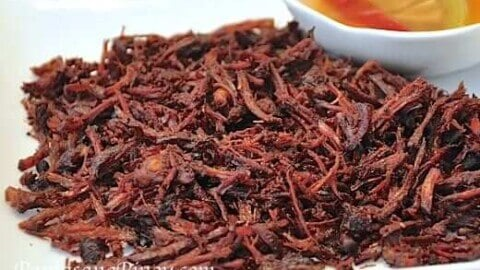
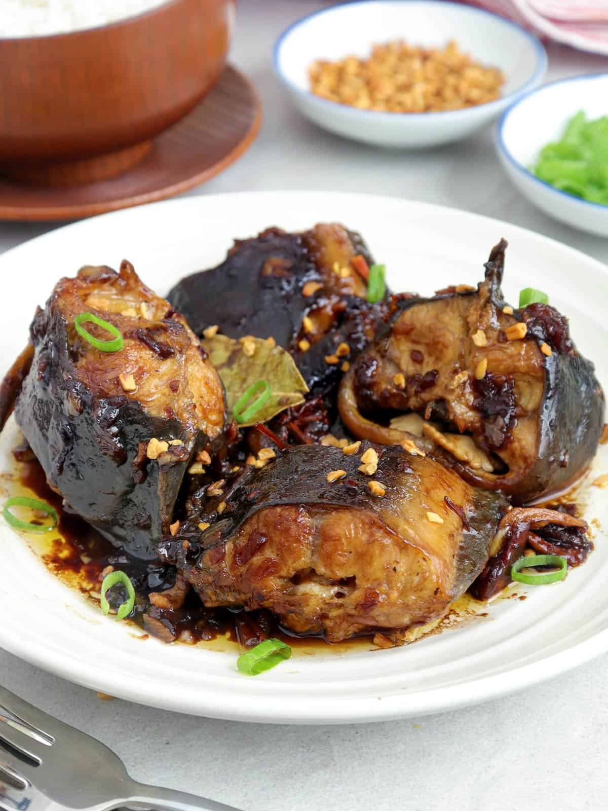
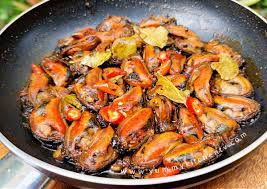

<!DOCTYPE html>
<!-- INCLUDE IN THE CONTENT:
     THE HISTORY OF THE FILIPINO DISH
     FOOD DESCRIPTION
     HOW IS FOOD INTRODUCED IN FILIPINO CULTURE?
     REASON WHY YOU LIKE/LOVE THE FOOD 
-->
<html>
    <head>
        <title>Best Filipino Food</title>
        <link rel="stylesheet" href="style.css">
    </head>
    <body>
        <!-- Title -->
    <ins><H1>My Favorite Food</H1></ins>

        <ins><H2>The Filipino of the Filipino Dish</H2></ins>
        
        <!-- History -->
    <ins><H2>THE HISTORY OF THE ADOBONG MALUTONG (CRISPY ADOBO)</H2></ins>
        
-Proving that Filipinos are highly resourceful when it comes to recycling leftovers, adobong malutong entails shredding the meat from leftover chicken and pork adobo, and <b><ins>frying</ins></b> them in hot oil until they are brown and crisp. 
            Crunchy adobo flakes are known for their long shelf-life (especially when refrigerated in a sealed container) and for their versatility (they are paired with everything from <em>kare-kare to lugaw)</em>. 
            In English, adobo means <em>“vinegar-braised”</em> Evenly-cut chunks of meat are first seared in hot fat or oil until they brown. Braising liquids, such as vinegar and soy sauce, are then added, and the mixture is left to simmer over low heat. 
        <mark> The moist heat gently penetrates the meat to break down the collagen and tough fibers, resulting in a fork-tender texture with a thick, flavorful sauce. It’s a cooking method that’s time-consuming but undeniably rewarding.</mark>  

           

<!-- VOCABULARY -->
          <ins><h3>VOCABULARY</h3></ins>
        <dl>
            <ins><b><dt>Frying</dt></b></ins>
            <b><dd>Frying is the cooking of food in oil or another fat.</dd></b>
            <ins><b><dt>Simmered</dt></b></ins>
        <b><dd>Simmering is a food preparation technique by which foods are cooked in hot liquids kept just below the boiling point of water and above poaching temperature.</dd></b>
            <ins><b><dt>Marinated</dt></b></ins>
        <b><dd>Marinating is the process of soaking foods in a seasoned, often acidic, liquid before cooking</dd></b>
        </dl> 
         
        <!-- introduced -->
            <ins><H2>How is food introduced in Filipino culture?</H2></ins>
            
 - Adobo, which typically consists of meat (often pork or chicken) <b><ins>marinated</ins></b> and <b><ins>simmered</ins></b> in a sauce made from vinegar, soy sauce, garlic, and other seasonings, is a versatile and cherished dish. 
                The introduction of Adobo involves both sharing this flavorful and hearty meal with others and embracing it as a staple of Filipino cuisine.  
                It is not only a delicious dish but also a source of pride and a symbol of Filipino culinary heritage.

                
        <!-- Reason -->
            <ins><H2>Reasons why you like/love the food?</H2></ins>
            
-The reason why i love Adobo. <mark> It's a dish that resonates with many due to its delicious flavor, cultural significance, and the warm memories associated with it.</mark> 
            Adobo is known for its rich and flavorful taste. The combination of salty soy sauce, tangy vinegar, and aromatic garlic and spices creates a delightful and savory flavor profile that many people find irresistible. 
            The slow cooking process in Adobo results in tender and succulent meat. The long marination allows the flavors to penetrate the meat, making it flavorful and juicy. 
            Adobo strikes a harmonious balance between the savory and sour elements, offering a delightful contrast of flavors that keeps diners coming back for more.   
    
            
 

            

        <ul>
            
            <!-- NUTRITION FACTS -->
           <ins><H3>NUTRITION FACTS</H3></ins>
              <b><li>Serving Size:1</b>
              <b> <li>cup (241ggrams)</b>
              <b> <li>Amount Per Serving</b>
              <b>  <li>Calories454</b>
              <b> <li>% Daily Value*</b>
              <b> <li>Daily Value Total </b>
              <b><li>Fat 25ggrams32%</b>
              <b> <li>Saturated Fat 9.1ggrams45%</b>
              <b> <li>Trans Fat 0ggrams</b>
              <b><li>Polyunsaturated Fat 2.1ggrams</b>
              <b> <li>Monounsaturated Fat 11ggrams</b>
              <b> <li>Cholesterol 138mgmilligrams46%</b>
              <b> <li>Sodium 2407mgmilligrams105%</b>
              <b> <li>Total Carbohydrates 5.1ggrams2%</b>
              <b> <li>Dietary Fiber 1ggrams4%</b>
              <b> <li>Sugars 0.7ggrams</b>
              <b> <li>Protein 50ggrams</b>
              <b><li>Potassium 805.4mgmilligrams17%</b>
        </ul>

     <!-- Ingredients -->
     <ul>        
            <ins><H3>INGREDIENTS</H3></ins>
        <b><li>2 lbs. pork belly cut into serving pieces</b>
        <b><li>1 medium Ghost Pepper</b>
        <b><li>2 teaspoons whole peppercorn</b>
        <b><li>6 cloves garlic crushed</b>
        <b><li>6 pieces dried bay leaves</b>
        <b> <li>12 pieces Thai chili</b>
        <b> <li>½ cup soy sauce</b>
        <b> <li>¼ cup white or cane vinegar</b>
        <b> <li>2 cups beef broth</b>
        </ul>

        <!-- Procedures -->
        <ul>
            <ins><H3>PROCEDURES</H3></ins>
        <b><li>Heat the oil in a cooking pot.</b>
        <b> <li>Add the garlic. Cook until it starts to turn light brown.</b>
        <b> <li>Add the peppercorns and bay leaves. Continue to cook for 20 seconds so that its flavors get infused in the oil.</b>
        <b> <li>Put the pork belly in the cooking pot. Stir and cook until it turns light brown. Note: check the garlic and make sure that it does not get burnt. Adjust heat if necessary.</b>
        <b> <li>Pour the soy sauce and beef broth (or water). Let boil. Cover and cook in low heat for 40 minutes or until the pork gets tender. Add more beef broth or water if the liquid starts to dry quickly.</b>
        <b> <li>Pour-in the vinegar. Let the liquid re-boil. Stir and cook for 8 minutes.</b>
        <b> <li>Taste your pork adobo and decide to add salt if needed.</b>
        <b> <li>Transfer to a serving plate. Serve.</b>
         <li><B>Share and enjoy!</B>
        </ul>

        <!-- LINKS -->
     <H2> LINKS</H2>

     <!-- Link 1-->
    

        <li><a href="https://panlasangpinoy.com/crispy-adobo-flakes-recipe/" target="_blank">CRISPY ADOBO FLAKES</a></li>
    

        
    

    <!-- Link 2-->
        <li><a href="https://www.kawalingpinoy.com/adobo-sa-gata/" target="_blank"> ADOBO SA GATA</a></li>
    

        
    

    <!-- Link 3-->
        <li><a href="https://panlasangpinoy.com/adobong-sitaw-string-bean-recipe/" target="_blank">Adobong Sitaw</a></li>
    

        
    

    <!-- Link 4-->
        <li><a href="https://www.kawalingpinoy.com/adobong-hito/" target="_blank">ADOBONG HITO</a></li>
    

        
    

    <!-- Link 5-->
        <li><a href="https://panlasangpinoy.com/adobong-tahong-recipe/" target="_blank">ADOBONG TAHONG</a></li>
    

        
    

    

    <ins><H3>Video</H3></ins>
    

        <video controls width="100" style="position: absolute; top: 0; left: 25%; width: 50%; height: 50%; border-radius: 10px; margin-left: 5px;">
            <source src="PORK ADOBONG TUYO with EGGS.mp4" type="video/mp4">
        </video>
    

    </body>

</html>
